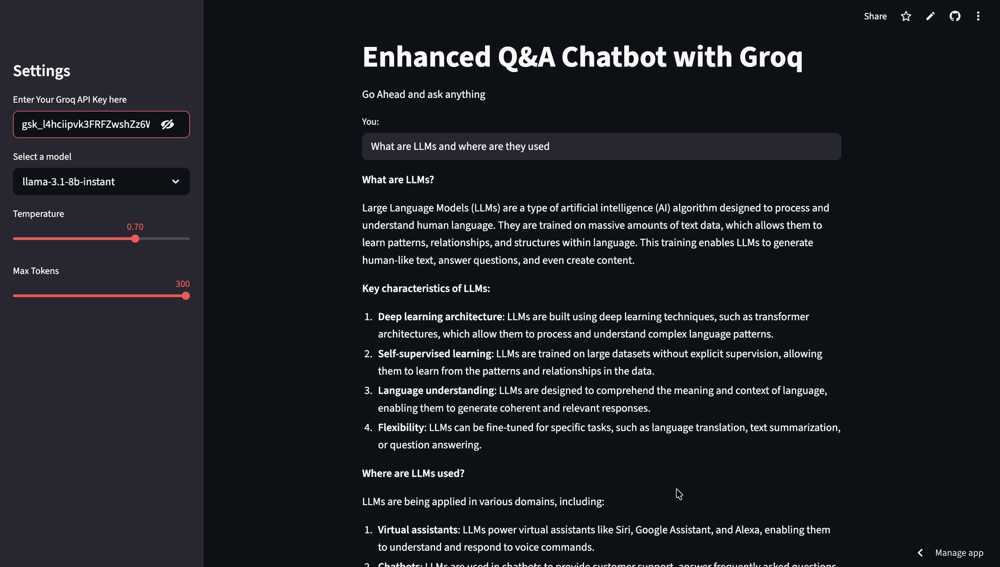
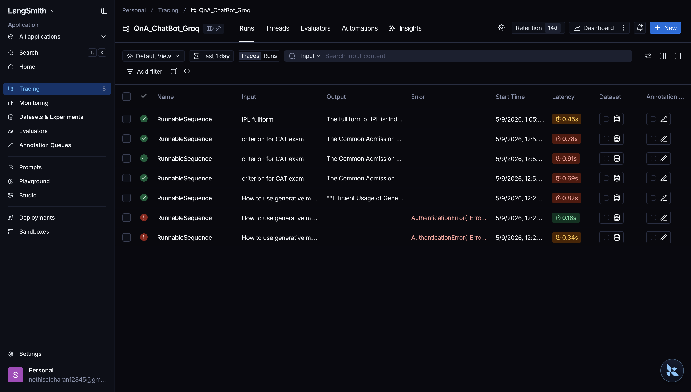

# LangChain Groq Q&A Chatbot

An AI-powered Q&A chatbot built using Streamlit, LangChain, and Groq APIs.  
The application supports multiple high-performance LLMs such as Llama 3.1, Llama 3.3, and GPT-OSS-20B, enabling users to interact with AI models through a fast and responsive web interface.

## Features
- Multiple Groq-hosted LLM support
- Interactive Streamlit UI
- Prompt chaining using LangChain
- Adjustable temperature and token settings
- Real-time AI response generation
- Secure API key input through the UI
- LangSmith tracing integration

## Supported Models
- llama-3.1-8b-instant
- llama-3.3-70b-versatile
- openai/gpt-oss-20b

## Tech Stack
- Python
- Streamlit
- LangChain
- Groq API
- LangSmith

## 🖥️ Demo

### Streamlit Chat Interface

### LangSmith Project & Traces

